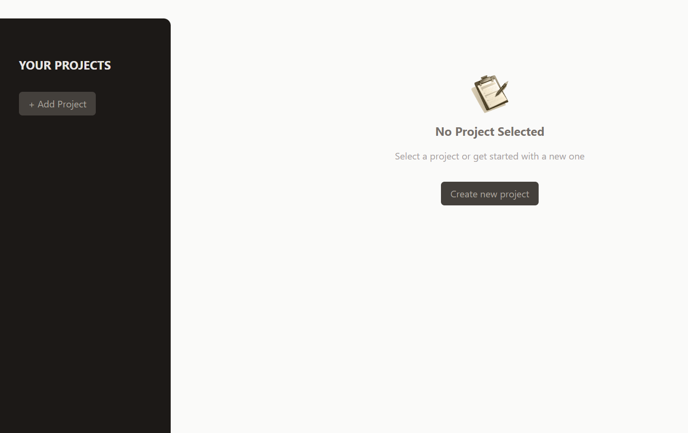

# Project Management App 🚀

This Project Management App is a simple web application built with React, Tailwind CSS, and JavaScript. It allows users to manage projects, add tasks, and keep track of their progress.

## Overview 🌐

The Project Management App consists of several components, each serving a specific purpose in the project management process. Users can add new projects, view project details, delete projects, and manage tasks within each project.


## Technologies Used 💻

- **React**
- **Tailwind CSS**
- **JavaScript**

## Features 🎉

- Add new projects with titles, descriptions, and due dates.
- View project details, including title, description, and due date.
- Delete projects that are no longer needed.
- Manage tasks within each project, including adding and deleting tasks.



## Usage 📊

1. Clone the repository to your local machine.
2. Navigate to the project directory.
3. Open the terminal and run the following command to install dependencies:

```bash
npm install
```

- Start the project with:
```bash
npm start
```

## Live Demo 🌐
Live Demo: [Project Management Demo](https://project-management-eosin.vercel.app/)

## Contributing 🤝
Feel free to use, modify, and contribute to the project! If you have any questions or feedback, you can reach me at your nisagokdemir@gmail.com

## License
This project is licensed under the **MIT License**.
